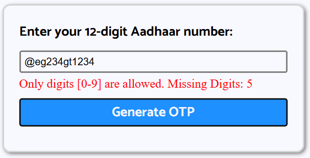

# Aadhaar Verification

### This project was completed under the internship titled "Digital Authentication using Digital Public Infrastructure" from Processware Systems (P) Ltd.,

The prototype was built to authenticate the user using Aadhaar credentials. User enters his/her Aadhaar number and give the consent (OTP) to retrieve their details.

### Key Features:
#### 1) Validation is done for entered Aadhaar number (12 digits) and OTP (6 digits).
The user must only enter digits. The prototype notifies the user of any invalid characters and the number of missing digits.

#### 2) Error messages are displayed based on the inputs. 
The prototype disables the buttons for the next step until valid input is entered.

#### 3) JavaScript is used to simulate API responses (mock data). 
Results are displayed in a layout similar to an actual Aadhaar alongside success messages and visual cues for better UX.

### Acknowledgements:

 - [Sandbox API](https://sandbox.co.in/)
 - [UIDAI Website](https://www.uidai.gov.in/en/ecosystem/authentication-devices-documents/developer-section/916-developer-section/data-and-downloads-section.html)
 - [Processware Systems](https://processwaresystems.com/)

